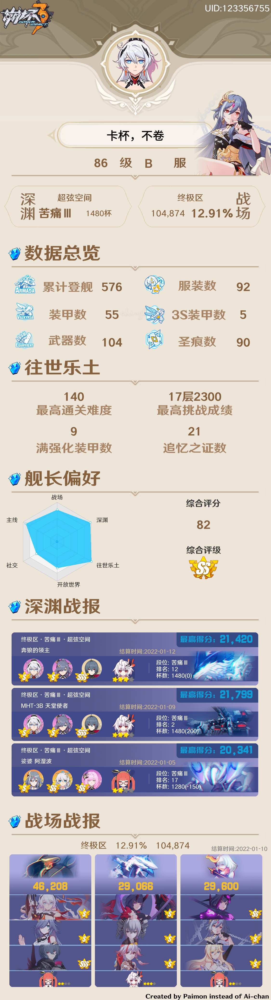
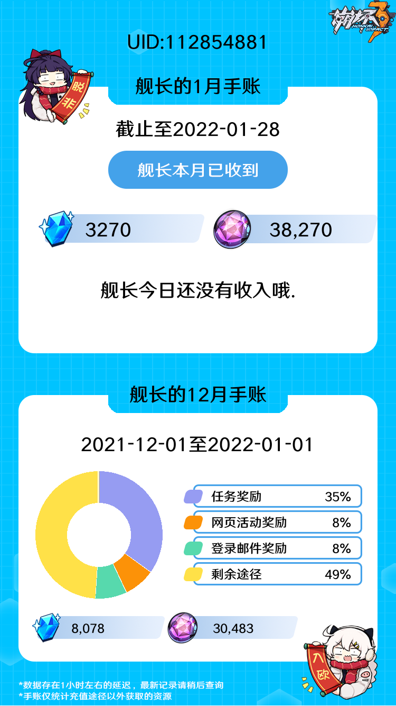

# 崩坏3米游社查询
仿[egenshin的player_info](https://github.com/pcrbot/erinilis-modules/tree/master/egenshin/player_info)样式做的崩坏3角色卡片.
- [崩坏3米游社查询](#崩坏3米游社查询)
  - [安装](#安装)
  - [使用](#使用)
  - [更新日志](#更新日志)
    - [2022/1/28](#2022128)
    - [2022/1/23](#2022123)
  - [致谢](#致谢)
## 安装
- 在hoshino的modules文件夹下clone本仓库
    ``` bash
    git clone https://github.com/chingkingm/honkai_mys.git
    ```
- 安装依赖
    ``` bash
    pip install -r requirements.txt
    ```
- 重命名 `config_example.yaml` 为 `config.yaml`,并按照格式填入cookie
- 修改__bot__.py,加入插件,重启bot

## 使用
|命令|功能|备注|
|-|-|-|
|bh#|玩家卡片|
|bhv#|所有女武神|
|bhf|手账|不需要uid|
1. 通过游戏uid加服务器查询
   - `命令<uid><服务器>`,如`bh#100074751b`.
2. 通过米游社id查询
   - `命令<id><米游社>`,即在提供米游社ID的同时加上"米游社"或"mys",如`bh#75098978米游社`
3. 不提供id
   - `命令`,会查询用户上一次查询的UID信息,如`bh#`

ps:每个uid只有首次查询的时候需要提供服务器.

<details>
<summary>玩家卡片示意图</summary>



</details>

<details>
<summary>女武神卡片示意图</summary>


</details>

<details>
<summary>手账示意图</summary>



</details>

## 更新日志
### 2022/1/28
1. 新增查询手账
   1. 支持使用egenshin已绑定的cookie,需要在config中填写配置,详见[config_example.yaml](config_example.yaml)
   2. 支持单独绑定,发送`bhf?`获取帮助
### 2022/1/23
1. 新增查询所有女武神,命令为`bhv#`,注意:第一次生成图片时,因为要下载圣痕,武器的素材,所以耗费的时间较长,可以下载release里的压缩包来减少届时的下载延迟
2. 调整了部分导入,方便调试
3. 新增了水晶手账相关代码,但具体样式未实现,该功能不可用
4. 更新了README,加入了更新日志
5. 完善渠道信息
6. 优化初次查询时的报错信息
## 致谢
- [egenshin](https://github.com/pcrbot/erinilis-modules/tree/master/egenshin),用了部分艾琳佬造好的轮子
